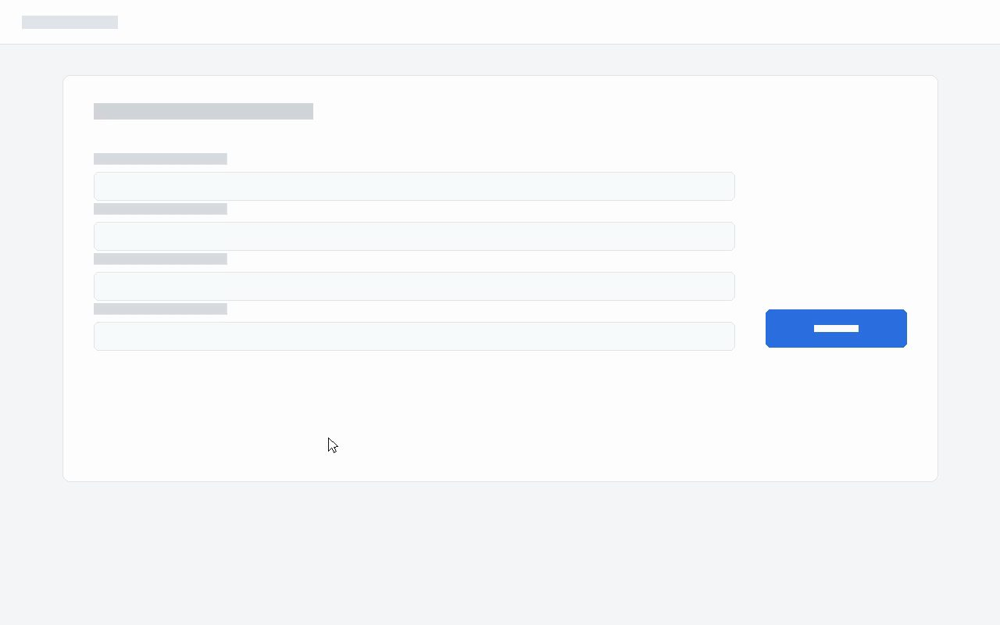
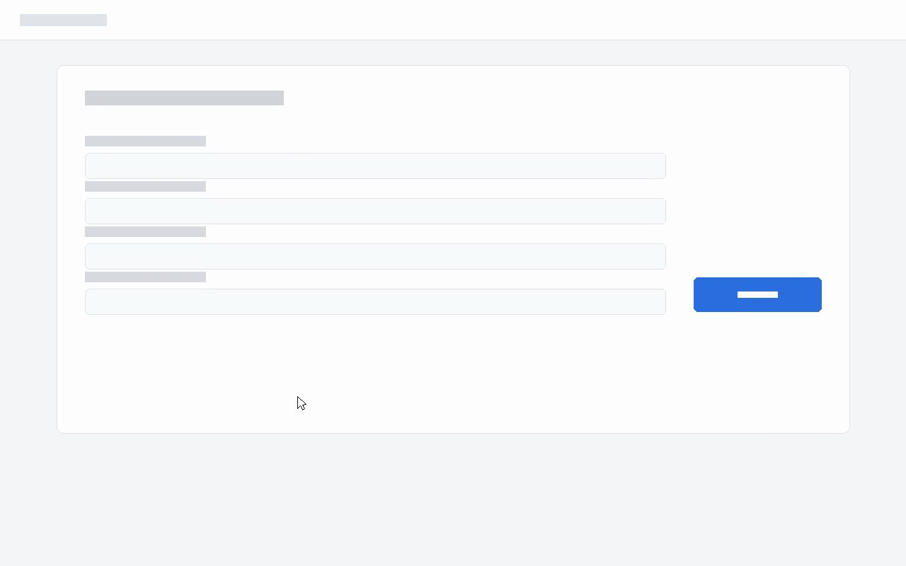
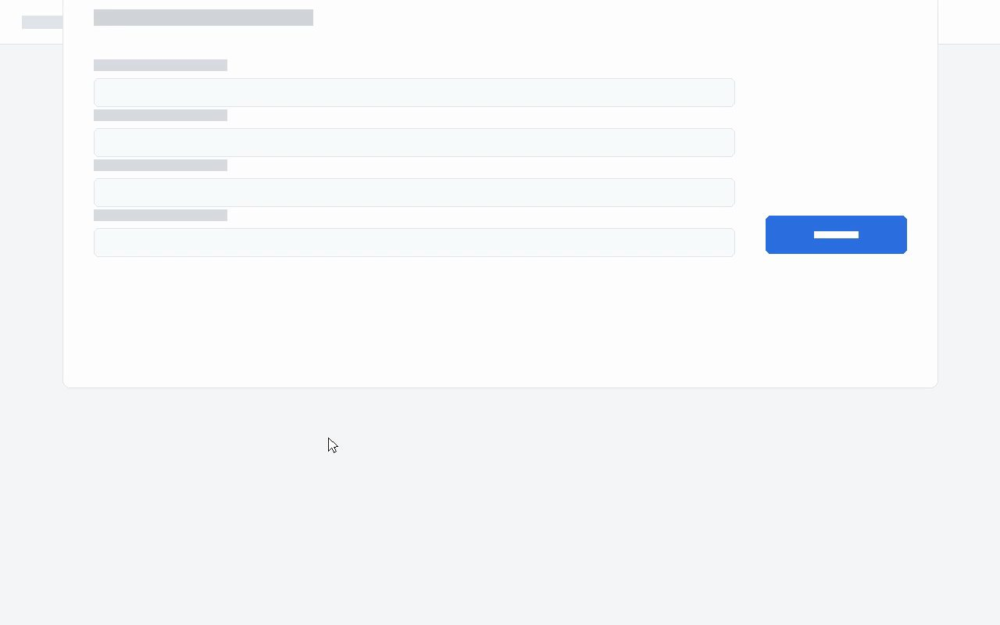
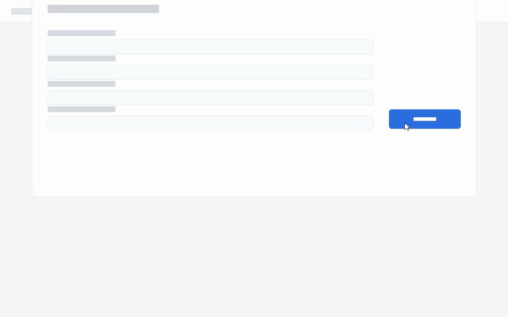
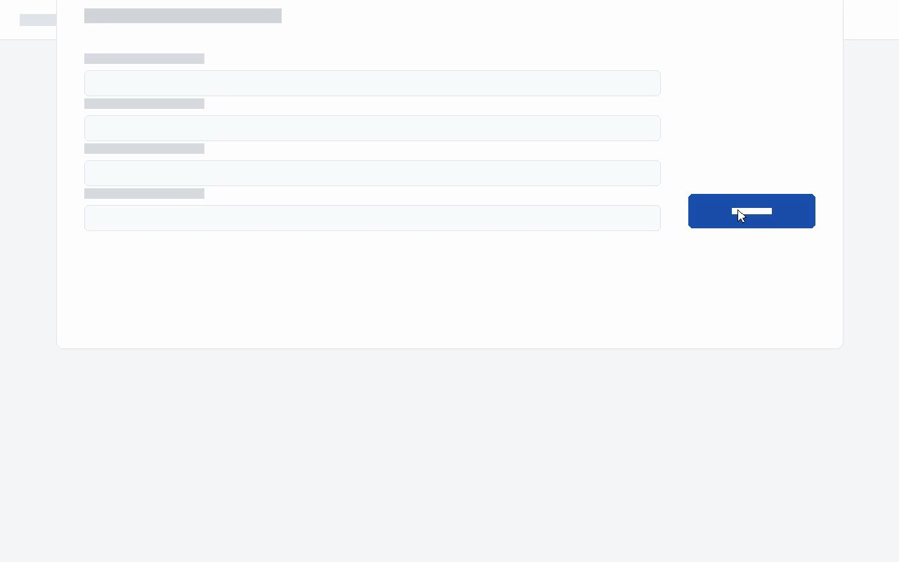

# Screen recording: sample_bug.mp4

**12.0s · 1280x800 · 30fps · 360 frames analysed · no speech**

## What stands out

- **Likely hang.** Something animated continuously in a small region, middle-right from 3.30s and was *still going when the recording ended* 8.7s later, with the rest of the screen frozen. It started 0.1s after a change at 3.20s, which is where the triggering interaction most likely is. Check the key frames to confirm it is a loading indicator.

## Timeline

| time | event | what changed |
| --- | --- | --- |
| `0.83s - 1.60s` | `scroll` | content scrolled down ~110px over 0.8s |
| `1.63s - 2.97s` | `pointer` | a small element moved across the screen from (34%,71%) to (81%,40%) - consistent with the mouse pointer |
| `3.00s` | `local-change` | 0.82% of the screen changed (small region, middle-right) [77%,34% to 91%,41%] |
| `3.20s` | `local-change` | 0.81% of the screen changed (small region, middle-right) [77%,34% to 91%,41%] |
| `3.30s - 11.97s` | `busy-indicator` | something animated continuously for 8.7s in a small region, middle-right while the rest of the screen was static [69%,30% to 75%,40%] |

## Key frames

### `0.00s` — first frame

### `0.83s` — start of scroll (0.83s)

### `1.60s` — end of scroll (1.60s)

### `2.95s` — just before local-change at 3.00s

### `3.15s` — just before local-change at 3.20s

### `3.30s` — start of busy-indicator (3.30s)

### `11.97s` — last frame

## How to read this

The timeline is produced by per-frame pixel analysis, not by a model. It
reports *what changed, where, and for how long* -- it does not know what
any of it means. Names like `busy-indicator` describe a visual pattern
(something animating in one small place while everything else holds still),
not a diagnosis.

To turn this into an explanation, read the key frames against the timeline.
The frames tell you what the UI is; the timeline tells you when it moved.
An event with no matching frame still happened -- the frame budget is
limited, and timings are exact to about one frame.
